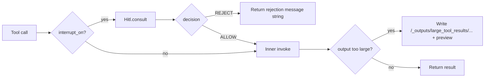

# `deepx` — core framework

`deepx` is the core library: **backend abstraction**, **factory** (`create_deep_agent`), **middleware** (hooks + tool pipeline + HITL), **built-in tools**, **SQLite session + compaction**, and **dynamic system prompt** assembly. It has **no UI dependencies**; the terminal helpers live in [`deepx_cli`](../deepx_cli/README.md).

- **Repo overview:** [`README.md`](../../README.md)  
- **Removed / historical design:** [`removed_features.md`](../../removed_features.md)

---

## Public API

```python
from deepx import (
    create_deep_agent,   # main factory (alias: DeepAgent)
    DeepAgentRunner,
    DeepRunBinding,
    DeepRunResult,
    FilesystemBackend,
    InMemoryBackend,
    LocalShellBackend,
    BackendProtocol,
)

from deepx.context import AgentContext   # not re-exported from deepx.__init__
from deepx.factory import Hitl           # HITL coordinator (also on deepx.factory.__all__)
```

Submodules (`deepx.middleware`, `deepx.tools`, …) are **public for imports** but not covered by a separate “stable facade” beyond the package above.

---

## Framework package tree (`src/deepx/`)

```text
src/deepx/
├── __init__.py              # create_deep_agent, runners, backends, BackendProtocol
├── _version.py
├── factory.py               # create_deep_agent, DeepAgentRunner, DeepRunBinding, DeepRunResult, Hitl
├── context.py               # AgentContext
├── sessions.py              # create_session → SQLite + compaction
├── system_prompt.py         # build_system_prompt (Agent.instructions)
├── backends/
│   ├── __init__.py
│   ├── protocol.py          # BackendProtocol, result dataclasses, eviction constants
│   ├── filesystem.py        # FilesystemBackend
│   ├── local_shell.py       # LocalShellBackend
│   ├── memory.py            # InMemoryBackend
│   └── utils.py             # paths, data_root_as_agent_path, MAX_READ_FILE_LINES, …
├── middleware/
│   ├── __init__.py          # lazy exports
│   ├── filesystem.py        # FilesystemHooks
│   ├── logs.py              # SessionToolLogHooks, plan/tool log helpers
│   ├── hitl.py              # Hitl, wrap_tools_for_hitl
│   ├── tool_pipeline.py     # eviction + apply_tool_pipeline
│   ├── run_hooks.py         # compose_run_hooks, ChainedRunHooks
│   └── observability.py     # setup_observability (LangSmith)
└── tools/
    ├── __init__.py          # builtin_tools_for_backend
    ├── filesystem.py        # ls, read_file, write_file, edit_file, grep, glob
    ├── execute.py
    ├── planning.py          # write_todos, think_tool, Plan
    └── agent_memory.py      # save_memory
```

---

## What the framework does (short)

1. **Backend** — All file I/O goes through **`BackendProtocol`**. Agent paths start with **`/`** under **`root_dir`**; metadata uses **`/.deepx/...`** (on disk: usually `<root_dir>/.deepx/...`).
2. **Tools** — Built-ins + your **`tools=`** + **subagent** `function_tool`s; **`apply_tool_pipeline`** adds **large-result eviction** and **HITL** for **`interrupt_on`** names.
3. **Prompt** — **`system_prompt`** is the **INSTRUCTIONS** slice; **`build_system_prompt`** fills CORE BEHAVIOR, CONTEXT, optional **CURRENT PLAN**, planning roster, skills, memory, filesystem rules—on **every** LLM call via **`Agent.instructions`**.
4. **Sessions** — **`checkpointer`** is a SQLite path (or `":memory:"`); **`create_session`** wraps **`SQLiteSession`** in **`OpenAIResponsesCompactionSession`** (compaction near **90%** of context window using **`gpt-5-nano`** in `sessions.py`).
5. **Subagents** — Each **`DeepAgentRunner`** in **`subagents=`** becomes a **`function_tool`** running nested **`Runner.run`** with the **child’s** backend/memory/debug and the **parent’s** `session_id` + **`Hitl`**.

---

## `factory.py` — `create_deep_agent` and runners

### `create_deep_agent`

Main entry point: builds an OpenAI Agents SDK **`Agent`**, wraps it in **`DeepAgentRunner`**, wires **backend**, **tool list** (after pipeline), **dynamic instructions**, **composed hooks**, and stores **checkpointer** path for **`bind()`**.

```python
runner = create_deep_agent(
    model="gpt-5-mini",
    name="orchestrator",
    description="…",                    # subagent tool description when this runner is a tool
    system_prompt="…",                # Instructions only; framework appends the rest
    tools=[…],                        # extra FunctionTool / Tool (MCP wrappers, etc.)
    subagents=[web_runner, sql_runner],
    skills=["./test_demo/skills/pdf"],
    memory=[".deepx/AGENTS.md"],
    backend=FilesystemBackend(root),
    checkpointer="path/or.db",          # or ":memory:"
    debug=True,
    max_turns=1000,
    interrupt_on=["execute"],
    include_general_purpose=True,
    response_format=None,
    run_hooks=(),
    model_settings=None,
    input_guardrails=None,
    output_guardrails=None,
    tool_use_behavior=None,
    reset_tool_choice=None,
    prompt=None,
)
```

**Design notes:**

- **`memory`** — List of **file paths** only. Resolved in order: backend **`_root_dir`** (if set) for relative paths, then **cwd**. Contents joined with `\n\n` → **`AgentContext.memory`** → **MEMORY** section.
- **`skills`** — Roots scanned for **`SKILL.md`**; catalog (name, description, path) goes into **SKILLS**. Bodies are **not** auto-inlined; the model uses **`read_file`**.
- **`interrupt_on`** — Each name must match a tool on the **final** list (built-ins + **`tools=`** + subagent tools) or **`ValueError`** at build time.
- **`debug=True`** (default) — Adds **`SessionToolLogHooks`** and enables **plan file + events** writes from **`write_todos`** (`run_log_save_plan` / `run_log_append_plan_event`). Set **`debug=False`** to skip those **log files**. **HITL `approvals.json`** is **not** tied to `debug`.
- **Do not** pass **`mcp_servers=`** on **`Agent`**. Wrap MCP as **`FunctionTool`** (e.g. FastMCP **`Client`**) and pass **`tools=`** so **eviction + HITL** apply.

### `DeepAgentRunner`

Returned by **`create_deep_agent`**. Holds configuration and the raw SDK **`Agent`**. Per-conversation state lives in **`DeepRunBinding`** from **`bind()`**.

```python
runner.bind(
    session_id: str,
    *,
    resume: bool = False,
    hooks: RunHooksBase | None = None,
    hitl: Hitl | None = None,
) -> DeepRunBinding

# Convenience (creates a binding internally):
async def run(self, task: str, *, session_id: str | None = None, resume: bool = False) -> DeepRunResult: ...
def run_sync(self, task: str, *, session_id: str | None = None, resume: bool = False) -> DeepRunResult: ...
async def run_stream(self, task: str, *, session_id: str | None = None, resume: bool = False): ...  # async generator of stream events + final dict
```

### `DeepRunBinding`

```python
async def run(self, inp: str | RunState) -> RunResult: ...
def run_streamed(self, inp: str | RunState) -> RunResultStreaming: ...
```

Prepared **`Agent`** (pipeline applied), **`create_session(session_id, checkpointer)`**, **`AgentContext`** on **`ctx`**. If **`hitl`** is set, **`hitl.attach_session(runner._backend, session_id)`** runs (loads allow-list from the **bound** runner’s backend).

### `DeepRunResult`

**`output`**, **`session_id`**, **`plan`** (**`Plan`** from **`write_todos`**), optional **`run_result`**.

### `include_general_purpose`

When **`True`** (default) and no subagent named **`general_purpose`**, a child **`DeepAgentRunner`** is appended with the same **`tools`**, **`skills`**, **`memory`**, **`backend`**, **`checkpointer`**, **`debug`**, **`run_hooks`**, **`response_format`**, but **no** nested subagents. Pass **`include_general_purpose=False`** to disable.

---

## `context.py` — `AgentContext`

```python
@dataclass
class AgentContext:
    session_id: str
    backend: BackendProtocol
    agent_name: str = ""       # set from agent.name in FilesystemHooks.on_agent_start
    memory: str = ""           # preloaded memory file text
    skills: str = ""           # skills catalog snippet for the prompt
    debug: bool = False
    resume: bool = False
    hitl: Hitl | None = None
    interrupt_on: frozenset[str] = field(default_factory=frozenset)
    plan: Plan                 # init=False; write_todos state
```

Tools receive **`RunContextWrapper[AgentContext]`** as **`ctx`**; the LLM never sees this object directly.

---

## `sessions.py` — conversation persistence

- **`SQLiteSession(session_id, db_path)`** (OpenAI Agents SDK) stores conversation items in SQLite.
- **`OpenAIResponsesCompactionSession`** wraps it: when usage reaches **~90%** of **`model_context_window`**, older turns are compacted with **`gpt-5-nano`** and written back.

**`create_session(session_id, checkpointer)`** is called inside **`DeepRunBinding`**. Nested subagent runs use a **different** `session_id` string: **`f"{parent}:{agent.name}:{tool_call_id}"`** with the **child’s** **`checkpointer`**.

---

## `system_prompt.py` — dynamic prompt assembly

**`build_system_prompt`** is used as **`Agent.instructions`** (dynamic callback), so it runs **before each LLM call**. Sections (see **`system_prompt.py`**): **INSTRUCTIONS** ← `system_prompt`, **CORE BEHAVIOR**, **CONTEXT** (UTC time, project root when known), optional **CURRENT PLAN** (when `write_todos` has populated `ctx.context.plan.todos`), **PLANNING & DELEGATION** (subagent roster + interrupt list), optional **SKILLS**, optional **MEMORY**, **FILESYSTEM** (and LocalShell extra block when applicable).

**Plans across REPL turns:** **`FilesystemHooks`** reloads the last saved plan from the backend when **`AgentContext.resume`** is **True** (so a **new** `deepx_cli` message starts with an **empty** todo list unless you launched with **`--session`** to resume and reload debug plan files). Each **`write_todos`** call still replaces the full list for the remainder of that agent run.

---

## `backends/` — scope of the agent

### `BackendProtocol`

Abstract methods: **`ls`**, **`read`**, **`grep`**, **`glob`**, **`write`**, **`edit`**, **`execute`**. Implementations return errors in **`ReadResult.error`**, etc., or for **`execute`** a **string** (either output or a fixed “not available” message)—they do **not** generally raise for “no shell”.

**`resolve_path`** — Optional host path for disk backends; **`InMemoryBackend`** returns **`None`**.

**`data_root`** — Present on concrete backends (**property**); not declared on the ABC in **`protocol.py`**.

### Path rules (agent paths)

- **`/…`** — Under **`root_dir`** (after coercion of absolute paths that lie under **`root_dir`**).
- **`/.deepx/…`** — Metadata; **not** reachable as normal project-relative `.deepx/` paths through workspace file tools (backend enforces).
- **`/_outputs/…`** — Deliverables; **replace** allowed per backend rules.
- **`FilesystemBackend.execute`** / **`InMemoryBackend.execute`** — Return a **string** explaining that shell is unavailable; **`LocalShellBackend.execute`** runs **`subprocess.run`**.

### Built-in backends

| Backend | Workspace | `/.deepx` on disk | `execute` |
|--------|-----------|-------------------|-----------|
| **FilesystemBackend** | Real files under **`root_dir`** | `<root_dir>/.deepx/` | Returns error **string** (no subprocess) |
| **LocalShellBackend** | Same | Same | **`subprocess.run(shell=True, cwd=root_dir, timeout≤600)`** |
| **InMemoryBackend** | In-process **`dict`**: workspace keys **`(session_id, rel_path)`**; **`.deepx`** keys use sentinel session **`__deepx__`** | N/A (no disk) | Returns error **string** |
---
**`InMemoryBackend`** — Workspace keys **`(session_id, "relative/path")`**; **`/.deepx/...`** maps to **`("__deepx__", ".deepx/...")`**-style keys (see **`memory.py`**). Nothing is persisted to disk unless you use a filesystem backend.

**`FilesystemBackend`** — Reads/writes use **`os.open` / file I/O** (not `aiofiles`). **`grep`** tries **`rg`** via **`_grep_via_ripgrep`**, then falls back to a Python scan (**`MAX_GREP_FILE_BYTES`** cap per file).

### `utils.py`

Shared helpers: **`data_root_for_host`**, **`data_root_as_agent_path`**, **`MAX_READ_FILE_LINES`**, path normalization **`_norm_agent_path`**, **`_coerce_agent_path`**, **`resolve_root_dir`**, **`resolve_data_root`**, **`resolve_backend_paths`**, eviction helpers re-exported from **`protocol`**.

---

## `middleware/` — hooks and wrappers

### Hook composition

Order in **`DeepAgentRunner._make_hooks`**: **`FilesystemHooks`** → **`SessionToolLogHooks`** if **`debug`** → user **`run_hooks`**. **`compose_run_hooks`** forwards **`RunHooksBase`** callbacks in sequence.

Use **`run_hooks`** for run-level middleware behavior. These are composed and forwarded to **`Runner.run` / `run_streamed`** as **`hooks=`**.

### `filesystem.py` — `FilesystemHooks`

**Why:** Keep **`agent_name`** / **`plan.agent_name`** in sync and **reload plan JSON** on **`resume=True`** from **`/.deepx/sessions/<id>/logs/plans/<agent>.json`** (requires those files to have been written with **`debug=True`** previously). The **deepx_cli** REPL sets **`resume`** only when the user passed **`--session`** so ordinary follow-up messages do not re-inject the previous turn’s **CURRENT PLAN** into the prompt.

### `logs.py` — `SessionToolLogHooks`

**Why:** Per-tool **audit JSON** under **`logs/tools/<tool>/<n>.json`** for debugging and support. **Only when `debug=True`.**

### `observability.py`

**`setup_observability()`** (called at start of **`create_deep_agent`**) registers **LangSmith** tracing for the Agents SDK when **`LANGSMITH_API_KEY`** is set (see file for env vars and **`OpenAIAgentsTracingProcessor`**).

### `hitl.py` — HITL

**`HitlRequest`** includes **`session_id`**, **`agent_name`**, **`tool_name`**, **`tool_call_id`**, **`arguments_json`**. **`consult(request, *, tool_backend=...)`** merges allow-list from each **backend** once per process, consults **`policy`**, and on **`ALLOW_ALWAYS`** persists the full allow set via **`tool_backend.write`** to **`/.deepx/sessions/<id>/approvals.json`**.

**Why:** Custom flow so **subagent** gates and **sticky** approvals work with **per-agent backends**; see **`removed_features.md`**.

### `tool_pipeline.py`

**`apply_tool_pipeline`** → **`wrap_tools_for_large_tool_results`** then **`wrap_tools_for_hitl`**.

**Reject path:** **`wrap_tools_for_hitl`** returns the string **`DEFAULT_REJECTION_MESSAGE`** to the model (does **not** raise a SDK “tool rejected” exception).



---

## `tools/` — built-in tools

All built-ins are **`@function_tool`** async functions taking **`RunContextWrapper[AgentContext]`** and delegating to **`ctx.context.backend`** (except planning/memory logic).

| Module | Tools | Notes |
|--------|-------|--------|
| **`filesystem.py`** | **`ls`**, **`read_file`**, **`write_file`**, **`edit_file`**, **`grep`**, **`glob`** | **`read_file`**: pagination, **`offset`** / **`limit`**; response size caps. **`glob`**: **`GLOB_TIMEOUT_S`**. |
| **`planning.py`** | **`write_todos`**, **`think_tool`** | Full **replace** todo list; plan logs **debug-gated**. |
| **`agent_memory.py`** | **`save_memory`** | Appends **`- [YYYY-MM-DD HH:MM UTC] fact`** to **`/.deepx/AGENTS.md`**. |
| **`execute.py`** | **`execute`** | **`asyncio.to_thread(backend.execute)`**; timeout capped **600s**. |

---

## Skills

Skill bundle = directory with **`SKILL.md`** + YAML frontmatter (`name`, `description`, …). Roots from **`skills=`** are scanned; catalog only in prompt—agent **`read_file`**s bodies as needed.

---

## Subagents

Each **`DeepAgentRunner`** in **`subagents=`** becomes a **`function_tool`** whose name is derived from **`runner._agent_name`** (non-alphanumeric → `_`). Nested context uses **child** backend/memory/skills/debug; **same** **`session_id`** and **`Hitl`** as parent. Tool objects may carry **`_is_agent_tool`** for roster formatting.

---

## Session persistence and resume

Use the **same** CLI **`session_id`** with **`resume=True`** on later **`bind()`** calls so **`FilesystemHooks`** can reload **plan** files. **Plan files** exist only if **`debug=True`** when todos were saved.

---

## Large-result eviction

Configured in **`protocol`** / **`tool_pipeline`** (~**`TOOL_RESULT_TOKEN_LIMIT`** tokens → char budget). Excluded tool names: **`ls`**, **`glob`**, **`grep`**, **`read_file`**, **`edit_file`**, **`write_file`** (see **`TOOLS_EXCLUDED_FROM_EVICTION`**).

---

## MCP tools

Wrap MCP as **`FunctionTool`** and pass **`tools=`** so **`apply_tool_pipeline`** applies eviction and **`interrupt_on`** consistently.

---

## `.deepx/` on disk (typical)

When **`root_dir`** is the repo and **`debug=True`**, you often see:

```text
.deepx/
├── AGENTS.md
└── sessions/
    └── <session_id>/
        ├── approvals.json          # optional; HITL ALLOW_ALWAYS
        └── logs/                   # only if debug=True
            ├── plans/
            │   ├── events.json
            │   └── <agent_name>.json
            └── tools/
                └── <tool_name>/
                    └── <n>.json
```

Deliverables use agent path **`/_outputs/`** → e.g. **`<repo>/_outputs/`**; spilled huge tool output → **`_outputs/large_tool_results/`**.
