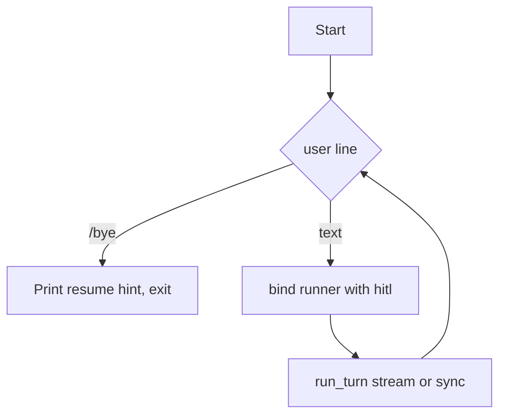

# `deepx_cli` — terminal chat

**`deepx_cli` is a very basic CLI** for the Deepx framework: a **prompt_toolkit** REPL that calls **`DeepRunBinding.run`** or **`run_streamed`**, plus optional **Rich + blocking-input HITL** (`create_terminal_hitl`). It is **not** a full product shell (no web UI, no multi-tab agent dashboards, no plugin system).

The **`deepx`** package has **zero** UI dependencies. **`deepx_cli`** needs the **`demo`** extra:

```bash
uv sync --extra demo
```

**Framework:** [`src/deepx/README.md`](../deepx/README.md) · **Repo root:** [`README.md`](../../README.md)

---

## Public API

```python
from deepx_cli import run_chat_stream, run_chat_sync
```

**`session.py`** and **`hitl.py`** are importable but **semi-internal** (API may change).

---

## Package tree

```text
src/deepx_cli/
├── __init__.py       # run_chat_stream, run_chat_sync
├── chat_stream.py    # streaming REPL
├── chat_sync.py      # non-streaming REPL
├── hitl.py           # create_terminal_hitl
└── session.py        # run_interactive_repl, parse_cli_session_arg
```

---

## `chat_stream.py` — `run_chat_stream`

```python
def run_chat_stream(runner: DeepAgentRunner, *, session_id: str | None = None) -> None: ...
```

- Binds **`runner`**, runs **`binding.run_streamed(user_input)`**, drains **`stream.stream_events()`**.
- With **`stream_text=True`**, **`drain_stream`** prints **`ResponseTextDeltaEvent`** deltas as they arrive.
- **`session_id`**: if **`None`**, uses **`parse_cli_session_arg()`** (`--session` from **`sys.argv`**); else generates a **12-char hex** id.

HITL pauses **inside** the tool wrapper (`on_invoke_tool`), not via a separate SDK “interruption” stream.

**Helpers:** **`run_stream_until_settled`**, **`drain_stream`** (same module).

---

## `chat_sync.py` — `run_chat_sync`

Same REPL as streaming, but **`await binding.run(user_input)`** and print **`final_output`** once complete.

---

## `hitl.py` — terminal HITL

```python
def create_terminal_hitl(console: Console) -> Hitl: ...
```

- **`asyncio.to_thread(input)`** so blocking prompts do not freeze the event loop.
- Choices **1 / 2 / 3** (and aliases like **`r`**, **`y`**, **`always`**) map to **`HitlDecision`**.

**`ALLOW_ALWAYS`** persists via **`Hitl._persist`** using the **tool runner’s** `backend` (see [`src/deepx/README.md`](../deepx/README.md)).

On **`REJECT`**, the wrapped tool returns **`DEFAULT_REJECTION_MESSAGE`** (string) to the model—it does **not** raise **`ToolRejectedError`**.

---

## `session.py` — shared REPL

### `run_interactive_repl`

```python
async def run_interactive_repl(
    runner: DeepAgentRunner,
    *,
    session_id: str | None,
    run_turn: Callable[[DeepRunBinding, str, Console], Awaitable[None]],
) -> None
```

1. Builds **`Hitl`** via **`create_terminal_hitl`**.
2. Resolves **`(sid, resuming)`** — new **`uuid.uuid4().hex[:12]`** or **`--session`**.
3. Loop: print **`You:`**, read line (**`PromptSession`**, **`multiline=False`**), **`/bye`** to exit.
4. Each turn: **`runner.bind(sid, resume=(resuming or turn > 0), hitl=hitl)`** then **`run_turn(binding, text, console)`**.
5. Prints resume hint (orchestrator-style message embedded in **`session.py`**).

### `parse_cli_session_arg`

**`argparse.parse_known_args`** on **`--session`** so it coexists with demo scripts’ own parsers.

### `_resolve_session(cli_session) -> (id, is_resuming)`

No environment-variable fallback.

---

## Custom frontends

You do **not** need **`deepx_cli`** for a web app or notebook: construct **`Hitl`** with your own async policy (webhook, auto-approve, etc.), **`runner.bind(..., hitl=hitl)`**, and call **`run` / `run_streamed`** yourself. See **`DeepRunBinding`** in [`src/deepx/README.md`](../deepx/README.md).

---

## REPL loop (mermaid)


